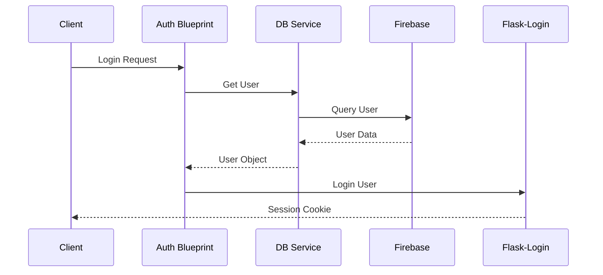

# AttendanceAI - Face Recognition Attendance System

A modern web-based attendance management system using facial recognition technology. Built with Flask, AWS Rekognition, and Firebase.

## Architecture Overview

### Component Structure
```
attendance-keeper/
├── app/
│   ├── blueprints/          # Route blueprints
│   │   ├── admin/          # Admin functionality
│   │   ├── attendance/     # Attendance management
│   │   ├── auth/          # Authentication
│   │   └── main/          # Core functionality
│   ├── config/            # Configuration files
│   │   ├── __init__.py
│   │   ├── development.py
│   │   └── production.py
│   ├── models/            # Data models
│   │   ├── __init__.py
│   │   └── user.py
│   ├── services/          # Business logic
│   │   ├── db_service.py
│   │   ├── rekognition_service.py
│   │   ├── firebase_service.py
│   │   ├── chatbot_service.py
│   │   ├── storage_service.py
│   │   └── email_service.py
│   ├── static/           # Static assets
│   ├── templates/        # Jinja2 templates
│   ├── utils/           # Helper functions
│   └── __init__.py      # App factory
├── tests/              # Test suite
├── requirements.txt    # Dependencies
└── run.py             # Entry point
```

### Key Components

1. **Application Factory (`app/__init__.py`)**
   - Creates and configures Flask application
   - Initializes extensions
   - Registers blueprints
   - Sets up error handlers
   - Configures logging

2. **Service Layer**
   - Implements business logic
   - Manages external service interactions
   - Follows singleton pattern for resource management
   - Handles caching and optimization

3. **Models**
   - Defines data structures
   - Implements business rules
   - Handles validation
   - Manages relationships

4. **Blueprints**
   - Organizes routes by feature
   - Implements view logic
   - Handles request/response cycle
   - Manages permissions

### Authentication Flow



### Development Guidelines

1. **Adding New Features**
   ```bash
   # 1. Create new blueprint
   mkdir app/blueprints/feature_name
   touch app/blueprints/feature_name/{__init__,routes,forms}.py

   # 2. Create service (if needed)
   touch app/services/feature_service.py

   # 3. Register blueprint in app/__init__.py
   ```

2. **Service Implementation**
   ```python
   class NewService:
       _instance = None
       
       def __new__(cls):
           if cls._instance is None:
               cls._instance = super().__new__(cls)
           return cls._instance
           
       def __init__(self):
           if not hasattr(self, 'initialized'):
               # Initialize service
               self.initialized = True
   ```

3. **Error Handling**
   - Use custom exceptions
   - Implement error handlers in blueprints
   - Log errors appropriately
   - Return consistent error responses

4. **Testing**
   ```bash
   # Run tests
   python -m pytest tests/
   
   # Run with coverage
   coverage run -m pytest
   coverage report
   ```

### Environment Setup

1. **Required Environment Variables**
```env
FLASK_APP=run.py
FLASK_ENV=development
SECRET_KEY=your-secret-key
FIREBASE_ADMIN_CREDENTIALS_BASE64=base64-encoded-credentials
AWS_ACCESS_KEY_ID=your-aws-key
AWS_SECRET_ACCESS_KEY=your-aws-secret
AWS_REGION=your-aws-region
```

2. **Firebase Setup**
   - Create Firebase project
   - Enable Authentication
   - Set up Firestore
   - Download service account key
   - Base64 encode the key file

3. **AWS Setup**
   - Create IAM user
   - Attach Rekognition policies
   - Configure environment variables

### Deployment

1. **Development**
   ```bash
   flask run --debug
   ```

2. **Production**
   ```bash
   gunicorn "app:create_app()"
   ```

### Common Tasks

1. **Adding a New Model**
   - Create model file in `app/models/`
   - Implement Firebase serialization
   - Add service methods
   - Create migration if needed

2. **Implementing New API Endpoint**
   - Add route to appropriate blueprint
   - Implement service logic
   - Add error handling
   - Document in README

3. **Adding New Service**
   - Create service class
   - Implement singleton pattern
   - Add error handling
   - Update service registry

## Contributing

1. Fork the repository
2. Create feature branch (`git checkout -b feature/name`)
3. Follow coding standards:
   - Use type hints
   - Add docstrings
   - Write tests
4. Submit pull request

## Troubleshooting

1. **Common Issues**
   - Firebase initialization errors
   - AWS credential issues
   - Blueprint registration problems
   - Circular import errors

2. **Solutions**
   - Check environment variables
   - Verify Firebase credentials
   - Review import order
   - Check service initialization

## License

MIT License - see LICENSE file

## Support

For support:
1. Check documentation
2. Review issues
3. Contact maintainers
4. Join community chat

## Recent Updates and Technical Details

### UI Improvements
- Enhanced template files with modern UI components
- Updated admin interface for better user management
- Improved classroom mode interface for real-time face detection
- Streamlined registration process UI
- Added responsive design elements to base template

### Face Detection System
- Implemented real-time face detection using `/detect_faces` endpoint
- Added continuous face detection in classroom mode
- Optimized detection frequency (approximately every 2-3 seconds)
- Successful detection responses (HTTP 200) indicate proper face recognition

### Attendance Management
- Enhanced attendance tracking system
- Added bulk attendance record viewing (supports viewing 70+ records)
- Implemented attendance status updates via API endpoints
- Added real-time attendance status modifications

### Admin Features
- Enhanced teacher management system (supports 5+ teachers)
- Improved student management interface (handles 20+ students)
- Added student data modification capabilities
  - Update student details (name, ID, class, division)
  - Real-time updates to student records
- Added subject management interface

### System Logging
- Implemented comprehensive logging system
- Added INFO level logging for key operations
- Logging categories:
  - Attendance operations
  - Student management
  - Teacher management
  - Face detection status

### API Endpoints
New and updated endpoints:
- POST `/detect_faces` - Real-time face detection
- GET `/attendance/view` - View attendance records
- PUT `/attendance/api/attendance/{id}/status` - Update attendance status
- GET `/admin/manage/teachers` - Teacher management
- PUT `/admin/api/teachers/{id}` - Update teacher details
- GET `/admin/manage/students` - Student management
- PUT `/admin/api/students/{id}` - Update student details

### Performance Optimizations
- Implemented caching for static assets
- Optimized database queries for attendance records
- Added efficient filtering for user queries
- Improved response times for face detection

### Chat System Integration
- Added chat.js integration
- Implemented system message handling
- Real-time chat functionality in dashboard

### Known Issues
- UserWarning: Firebase filter using positional arguments (to be updated to keyword arguments)
- Consider updating the Firebase query syntax in admin.py:194

